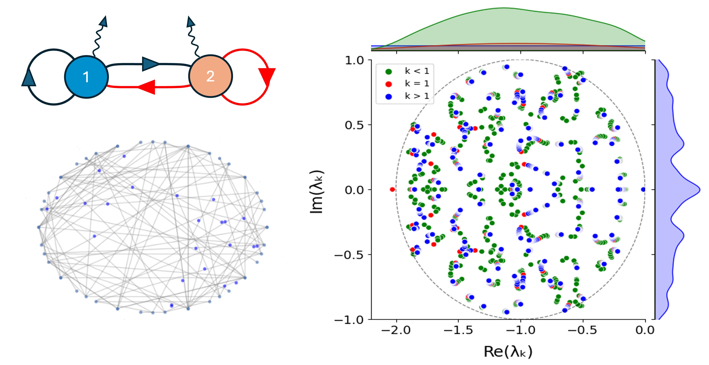

# Optimal network size for most robust Turing patterns 

#### This repository contains notebooks and Python scripts used to generate figures 2-8 in the following [paper]().  
#### The code was developed by Prof. Dr. Robert Endres' group at Imperial College London. 

***

### Code organisation: 
- `Simulation_code.py` - Code to simulate the data. See description in script for different arguments.
- `Figure_3_hists.py` - Code to generate the histograms with the beta distributions. Need to modify paths to data.
- `Figure_4_beehive.py` - Code to generate the swarm/beehive plots in Fig. 4. Need to modify paths to data.
- `Figure_4_sum_dists.py` - Code to generate the sum of Jacobian element distributions in Fig. 4. Need to modify paths to data.
- `figure_5.jpynb` - tutorial on how to generate circular scatter plot and corresponding kernel density estimations of eigenvalues in the complex plane with examples
- `figure_6.jpynb` - tutorial on how to generate:
  - a) % of stable random matrices vs radius γ plot
  - b) % of stable random matrices turning unstable with diffusion vs radius γ plot
  - c) % of Turing instabilities vs raidus γ plot
  - d) % of Turing 1 instabilities vs raidus γ plot
- `figure_7.jpynb` - tutorial-style comprehensive explanation of figure7_re_v5.py 
- `figure7_re_v5.py` - generates heatmaps of % Turing 1 occurences and corresponding percentage shares plots 
- `figure_8.jpynb` - tutorial-style comprehensive explanation of figure8_HS_v3.py
- `figure8_HS_v3.py` - generates heatmaps of % of Turing (all types) and Turing 1 occurences for different diffusion parameters *D* and network sizes *N*
- `SI_eigenvalue_distribution.ipynb` - produces supplementary plots related to the asymptotic and finite-N effects of eigenvalue spectra, including comparison of analytical and numerical eigenvalue spectrum, marginal density, and Turing density analyses.

For details on functionality see the description at the beginning of the script.
***

### Requirements  

#### In order to run the Python scripts you need: 
- Python 3.9 or higher
- Estimated runtime: `figure8_HS_v3.py` - 3 days on 4 CPUs 

***

### Contacts
Prof. Dr. Robert Endres: r.endres@imperial.ac.uk
